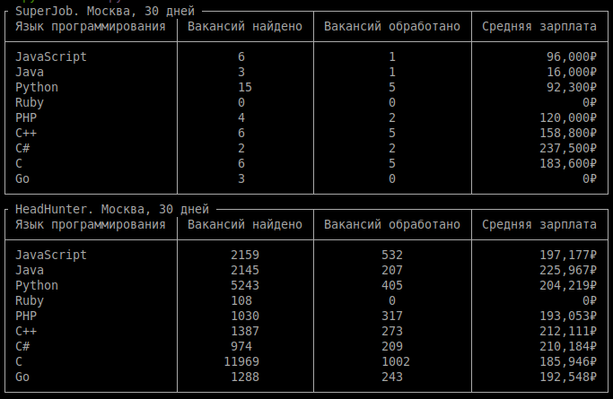

# Узнай будущую зарплату

### Собираем статистику по средней зарплате с сайтов [SuperJob](https://www.superjob.ru/) и [HeadHunter](https://hh.ru) по заданным профессиям, за определенный период



## Как установить и запустить

[Установите Python](https://www.python.org/), если этого ещё не сделали.

Проверьте, что `python` установлен и корректно настроен. Запустите его в командной строке:
```sh
python --version
```
**Версия Python должна быть не ниже 3.10** 

Возможно, вместо команды `python` здесь и в остальных инструкциях этого README придётся использовать `python3`. 

- Склонируйте репозиторий:
```shell
git clone https://github.com/spawlov/EstimateSalary.git
```

- Установите зависимости и активируйте виртуальное окружение, для этого запустите последовательно команды:
```shell
poetry install
poetry shell
```

- Получите API токен на сайте [SuperJob](https://api.superjob.ru/)
- Зарегистрируйте приложение на сайте [HeadHunter](https://dev.hh.ru/)
- Создайте файл ```.env```

```text
LANGS=JavaScript,Java,Python,Ruby,PHP,C++,C#,C,Go - Список языков для запроса (через запятую, без пробела)
CITY=Москва (Город, по которому будет производиться поиск вакансий)
DAYS=30 (Период, за который будет производиться поиск вакансий)

SJ_KEY=<API_TOKEN_SUPER_JOB>

HH_REDIRECT_URI=https://example.com/redirect/
HH_CLIENT_ID=<CLIENT_ID_HEAD_HUNTER>
HH_CLIENT_SECRET=<CLIENT_SECRET_HEAD_HUNTER>
```

- Программа запускается командой:

```shell
python main.py
```

***Важно! После первого запуска приложения откроется браузер - нужно авторизоваться на сайте hh.ru и получить одноразовый код (в адресной строке вашей странице редиректа), который нужно ввести в терминал. Будет создан файл `.hh_credentials.json` с токенами hh.ru***

<hr>

#### Код написан в учебных целях — это урок в курсе по Python и веб-разработке на сайте [Devman](https://dvmn.org).
